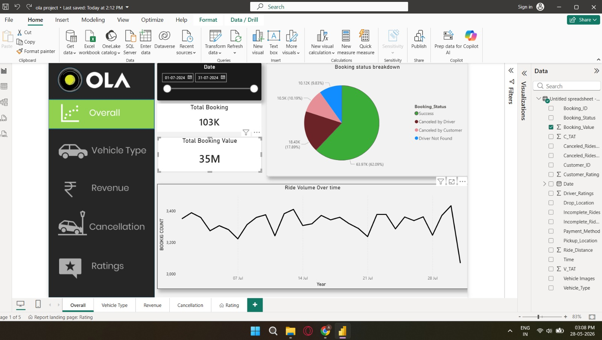

<h1 align="center">🚖 OLA Ride Analytics Dashboard</h1>

<p align="center">
<b>Interactive Business Intelligence Dashboard built using Power BI</b>
</p>

<p align="center">

</p>

<p align="center">


</p>

---

## 📌 Overview

This Power BI dashboard analyzes **100,000+ OLA ride bookings** to uncover insights into booking trends, revenue, ride cancellations, customer satisfaction, and vehicle performance. Using **Power Query**, **DAX**, and **Data Modeling**, raw ride data is transformed into an interactive dashboard for data-driven decision-making.

---

## 🖥 Dashboard Preview

<p align="center">

</p>

---

## 📊 Dashboard Pages

| Dashboard | Description |
|-----------|-------------|
| 📈 Overall | Business KPIs & Booking Summary |
| 🚖 Vehicle Type | Vehicle-wise Performance |
| 💰 Revenue | Revenue & Booking Trends |
| ❌ Cancellation | Customer & Driver Cancellations |
| ⭐ Ratings | Customer & Driver Ratings |

---

## 📈 Key KPIs

| KPI | Description |
|------|-------------|
| 📦 Total Bookings | Overall Ride Requests |
| ✅ Successful Rides | Completed Trips |
| 💰 Revenue | Total Revenue Generated |
| ❌ Cancelled Rides | Customer & Driver Cancellations |
| 📍 Distance Travelled | Total KM Covered |
| ⭐ Customer Rating | Average Rating |
| 👨‍✈️ Driver Rating | Driver Performance |

---

## 💡 Key Insights

- 📈 Peak booking hours identified for better driver allocation.
- 💰 Revenue trends highlight high-demand periods.
- 🚖 Vehicle-wise analysis reveals top-performing categories.
- ❌ Cancellation reasons help improve operational efficiency.
- ⭐ Ratings provide insights into customer satisfaction.
- 🎯 Interactive slicers enable dynamic analysis by date and ride type.

---

## 🛠 Tech Stack

| Tool | Purpose |
|------|---------|
| 📊 Power BI | Dashboard Development |
| ⚙ Power Query | Data Cleaning |
| 🧮 DAX | Measures & KPIs |
| 🗂 Data Modeling | Relationships |
| 📈 Visualization | Interactive Charts |

---

## 📂 Repository Structure

```text
OLA-Ride-Analytics/
│
├── ola project updated.pbix
├── ola file.csv
├── overall.jpeg
├── Revenue.png
├── vehicle type.png
├── cancellation.png
├── rating.png
└── README.md
```

---

## 🚀 Skills Demonstrated

<p align="center">

📊 Data Visualization • 📈 Business Intelligence • 🧮 DAX • ⚙ Power Query • 🗂 Data Modeling • 📌 KPI Design • 📊 Dashboard Development

</p>

<p align="center">

</p>
